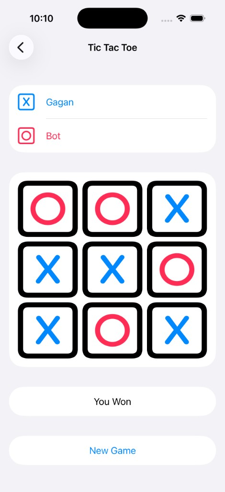
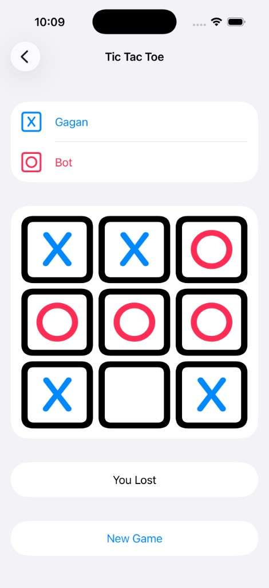
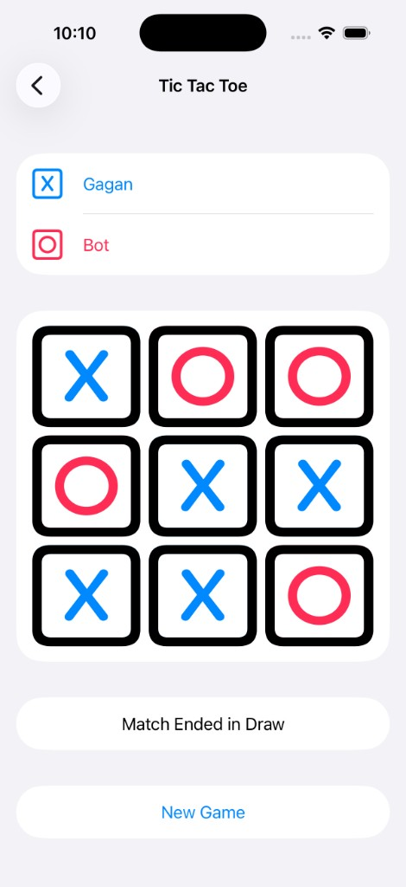

# TicTacToe

A native iOS Tic Tac Toe game — shared game core, protocol-driven players, and pluggable bot strategies per difficulty.

A **protocol-oriented SwiftUI reference** for building a small game where the rules, players, and AI are decoupled: the same board logic runs everywhere, while each bot difficulty plugs in its own move strategy.

---

## Screenshots

| Start screen | You win | You lose | Draw |
|:---:|:---:|:---:|:---:|
|  |  |  |  |

---

## The problem

- One game, many move behaviors (Easy / Medium / Hard)
- Same board rules and win/draw logic everywhere
- Human and bot players that must be interchangeable
- UI that stays untouched when AI behavior changes

## The approach

**Protocol-oriented layering** — one game model, swappable players and strategies behind protocols, not branching logic scattered through the UI.

```
StartTheGame → TicTacToe (View) → TicTacToeViewModel → Game → Board / BoardCell
                                                          ↓
                                              Player (Human / Bot)
                                                          ↓
                                                  PlayingStrategy (Easy / Medium / Hard)
```

| Shared | Per player / difficulty |
|--------|-------------------------|
| Board, BoardCell, Move models | Symbol choice (X / O) |
| Win / draw detection, turn flow | Bot difficulty level |
| `Player` & `PlayingStrategy` protocols | Move-selection strategy |

**Patterns:** Strategy, Protocol abstraction, MVVM, `@Observable` state, SwiftUI views.

---

## Bot difficulty

Each difficulty is a separate `PlayingStrategy` implementation:

| Level | Behavior |
|-------|----------|
| **Easy** | Picks a random available cell. |
| **Medium** | Takes an immediate winning move if available, otherwise blocks the opponent's winning move, otherwise plays randomly. |
| **Hard** | Plays optimally using the **minimax** algorithm — effectively unbeatable. |

---

## Project layout

```
TicTacToe/
├── App/              Entry point + start screen — wire game setup here
│   ├── TicTacToeApp.swift
│   └── StartTheGame.swift
├── Models/           Shared game models & rules — never edited per strategy
│   ├── Game.swift            Turn flow, win/draw detection
│   ├── Board.swift           Board state (N×N grid)
│   ├── BoardCell.swift       Single cell
│   ├── Move.swift            A move (row, column)
│   ├── GameSymbol.swift      X / O symbol + rendering
│   └── GameStatus.swift      In progress / won / lost / draw
├── Player/           Player abstractions
│   ├── Player.swift          Player protocol
│   ├── HumanPlayer.swift
│   ├── BotPlayer.swift       Selects a strategy by difficulty
│   └── User.swift
├── Strategies/       Bot move strategies
│   ├── PlayingStrategy.swift         Strategy protocol
│   └── RandomPlayingStrategy.swift   Easy (random) / Medium (win-block) / Hard (minimax)
├── TicTacToeView/    Game screen
│   ├── TicTacToeView.swift           Board UI
│   └── TicTacToeViewModel.swift      View ↔ game bridge
├── Extensions/       SwiftUI helpers
└── Utilities/        SoundPlayer (system sound effects)
```

**`Models` vs `Strategies`:** `Models` holds shared rules and does **not** change when you add a new bot behavior. New AI behavior lives in `Strategies` and is selected in `BotPlayer` only.

---

## Add a bot strategy

1. Create a new type in `Strategies/` conforming to `PlayingStrategy`:

```swift
class ExpertPlayingStrategy: PlayingStrategy {
    func play(board: Board, botSymbol: GameSymbol) -> Move {
        // your move-selection logic
    }
}
```

2. Add a case to `BotLevel` and wire it in `BotPlayer`'s strategy switch:

```swift
case .expert:
    self.strategy = ExpertPlayingStrategy()
```

Do not edit `Game`, `Board`, or the views.

---

## Run

1. Open `TicTacToe.xcodeproj`
2. Select an iPhone simulator → **Run** (⌘R)
3. Enter your details → pick a symbol & level → **Enter the game**

**Requires:** Xcode 15.1+, iOS 17.2+

---

## Related LeetCode problems

The game decomposes into classic algorithm problems. No single problem matches
the whole app, but these map directly to its parts.

**Board & win detection** (like `Game.checkWinner` / `isWinner`)

| # | Problem | Relevance |
|---|---------|-----------|
| 1275 | Find Winner on a Tic-Tac-Toe Game | Almost identical win-detection logic |
| 794 | Valid Tic-Tac-Toe State | Validating a board configuration |
| 348 | Design Tic-Tac-Toe (Premium) | Efficient O(1) per-move win tracking |

**Optimal play / minimax** (like `HardPlayingStrategy`)

| # | Problem | Relevance |
|---|---------|-----------|
| 464 | Can I Win | Minimax + memoization — closest algorithmic twin |
| 486 | Predict the Winner | Minimax over a range, optimal play |
| 294 | Flip Game II | Minimax with memoization (recurse + undo) |
| 375 | Guess Number Higher or Lower II | Minimax framed as minimizing worst-case cost |
| 877 | Stone Game | Two players play optimally (minimax / DP) |
| 913 | Cat and Mouse (Hard) | Minimax / game theory on a graph |

---

## License

**Proprietary — all rights reserved.** See [LICENSE](LICENSE).

You may view and run for personal, non-commercial evaluation only with permission. Copying, modifying, distributing, or commercial use is not permitted without written consent from Gagan Joshi.

---

**Gagan Joshi** — protocol-oriented SwiftUI game architecture exercise.
